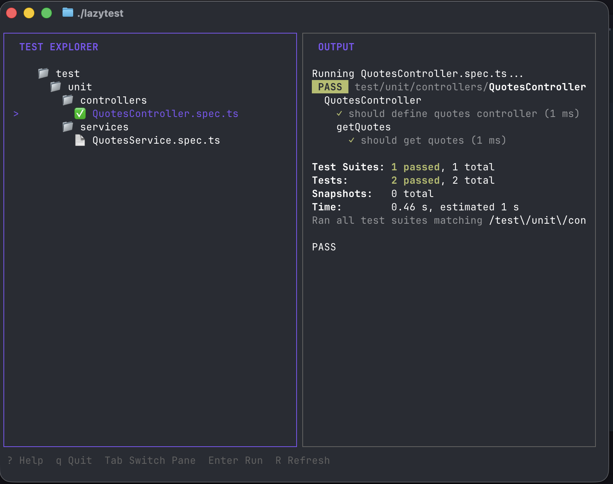

# LazyTest

LazyTest is a terminal user interface (TUI) for running tests in TypeScript and JavaScript projects, heavily inspired by the excellent [lazygit](https://github.com/jesseduffield/lazygit). It provides a fast, keyboard-centric workflow for navigating test files, executing them, and viewing results instantly.

While it defaults to **Jest**, LazyTest is **test-runner agnostic** and can be configured to work with Vitest, Playwright, or any CLI-based test runner.



## Features

*   **Vim-style Navigation**: Navigate your file tree with `j`, `k`, `h`, `l`.
*   **Instant Feedback**: Real-time output streaming with ANSI color support.
*   **Smart Mode (Auto-Run)**: Toggle a persistent Smart Mode with `s`. When active, any file change automatically queues every transitively-affected test — no manual watching required. The Watched tab is replaced by an "Affected Suite" tab that is dynamically sorted by status (Fail → Running → Pass).
*   **Zero-Touch Auto-Focus**: In Smart Mode, when a test fails, LazyTest automatically jumps to the failed test in the Affected Suite tab so you can immediately see the error output.
*   **Suite Stats Badge**: In Smart Mode, a live stats badge appears above the output view showing progress (e.g., `⚡ SMART MODE | N Passed • N Failed • N Running`).
*   **Smart Test Selection (Manual Mode)**: Use `a` to add tests related to currently changed source files (via `git diff`) to your watched list in one keypress.
*   **File Watching**: Automatically detects new test files and updates the tree in real-time.
*   **Context Awareness**: Automatically finds the nearest `package.json` to run tests in the correct context (perfect for monorepos).
*   **Status Indicators**: Visual feedback for running (⏳), passed (✅), and failed (❌) tests.
*   **Watched Files Tab**: View and manage your list of manually watched files in a dedicated tab.
*   **Search**: Quickly find files with `/` and navigate matches with `n`/`N`.
*   **.gitignore Support**: Automatically respects `.gitignore` patterns and common ignore patterns.
*   **Customizable**: Configure custom test commands and overrides via `.lazytest.json`.

## Quick Start

### Prerequisites

*   **To Build**: [Go](https://go.dev/dl/) (1.21 or later).
*   **To Run**: Any environment with your preferred test runner (Jest, Vitest, etc.) and `npx` (if using the default command).

### Installation

**Download Binary**: Pre-compiled binaries for macOS, Linux, and Windows are available on the [GitHub Releases](https://github.com/jesspatton/lazytest/releases) page.

**Build from Source**: Alternatively, clone the repository and build it yourself:

```bash
git clone https://github.com/jesspatton/lazytest.git
cd lazytest
go build -o lazytest .
```

### Usage

Navigate to your project directory and run the binary:

```bash
./lazytest
```

(Optional) Move the binary to your PATH:

```bash
mv lazytest /usr/local/bin/
```

### Keybindings

| Key | Action |
| :--- | :--- |
| `j` / `↓` | Move cursor down |
| `k` / `↑` | Move cursor up |
| `Enter` | Run the selected test file |
| `Tab` | Switch between File Explorer and Output panes |
| `s` | **Toggle Smart Mode**: Automatically queue all tests affected by file changes. The footer badge updates and keybinding labels dynamically swap based on mode. |
| `a` | **Add Related (Manual Mode)** / **Run Suite (Smart Mode)**: Add tests related to git diffs, or manually run the entire affected suite. |
| `f` | **Run Failures**: (Smart Mode only) Re-run only the failed tests in the affected suite. |
| `r` | Re-run the last executed test |
| `R` | Refresh file tree |
| `/` | Enter Search Mode |
| `n` | Next Search Match |
| `N` | Previous Search Match |
| `Esc` | Exit Search Mode |
| `]` | Next Tab |
| `[` | Previous Tab |
| `w` | Toggle Watch Mode for selected file |
| `W` | **Clear Watched (Manual Mode)** / **Clear Suite (Smart Mode)**: Clear all manually watched files or clear the affected suite. |
| `?` | Toggle Help Menu |
| `q` / `Ctrl+C` | Quit |

## Configuration & Test Runner Support

By default, LazyTest runs:
```bash
npx jest <path> --colors
```
The `<path>` placeholder is automatically replaced with the relative path to the test file.

### Custom Configuration (`.lazytest.json`)

Create a `.lazytest.json` in your project root to customize behavior.

**Supported Fields:**
*   `command`: The global test command. Use `<path>` as a placeholder for the file path.
*   `overrides`: Specific commands for file patterns (useful for mixed environments or monorepos).
*   `excludes`: Directories to hide from the explorer.

**Example: Using Vitest**
```json
{
  "command": "npx vitest run <path>"
}
```

**Example: Advanced Configuration**
```json
{
  "command": "npm test --",
  "excludes": ["e2e", "dist"],
  "overrides": [
    {
      "pattern": "packages/ui/**",
      "command": "npm run test:ui -- <path>"
    }
  ]
}
```

## Tech Stack & Architecture

LazyTest is built with Go and uses the [Charm](https://charm.sh/) ecosystem.

*   **Language**: Go (Golang)
*   **TUI Framework**: [Bubbletea](https://github.com/charmbracelet/bubbletea)
*   **Styling**: [Lipgloss](https://github.com/charmbracelet/lipgloss)
*   **Components**: [Bubbles](https://github.com/charmbracelet/bubbles)
*   **File Watching**: [fsnotify](https://github.com/fsnotify/fsnotify)
*   **File Walking**: [gocodewalker](https://github.com/boyter/gocodewalker)

### Project Structure

*   `ui/`: TUI logic, models, and styles.
*   `engine/`: Coordinates execution, state, and watching.
*   `runner/`: Manages process execution and configuration parsing.
*   `analysis/`: Dependency graph parsing for Smart Test Selection.
*   `filesystem/`: High-performance directory walking and `.gitignore` support.

## Development

Check out the [Dev Log](DEVLOG.md) to see a history of major features and structural changes implemented.
